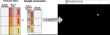
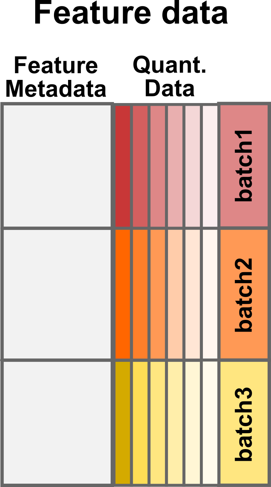
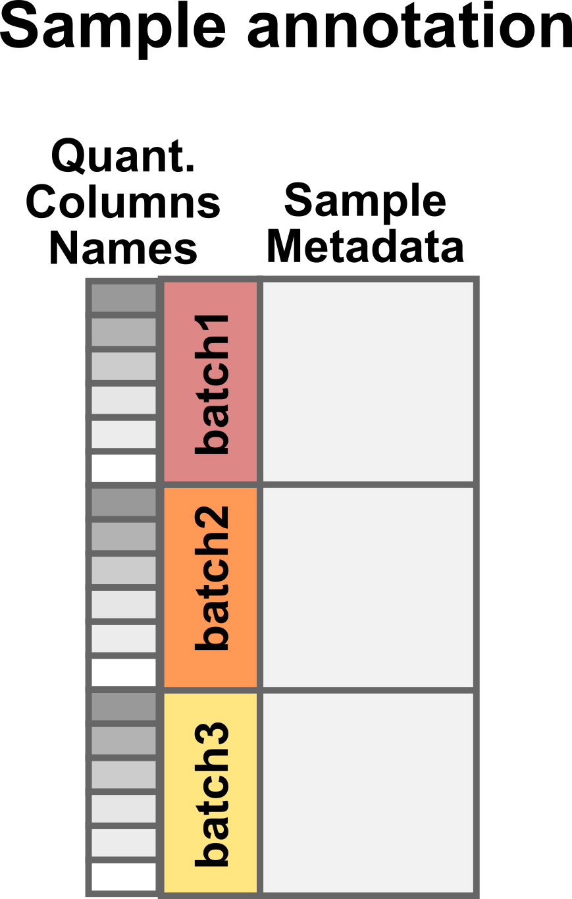
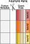

```{r theme, echo=FALSE}
xaringanthemer::style_mono_light(base_color = "#23395b")
```

```{r xaringanExtra, echo=FALSE}
xaringanExtra::use_webcam()     ## use w to turn on webcam
xaringanExtra::use_tile_view()  ## use o to get an overview
xaringanExtra::use_fit_screen() ## use Alt-F to fit to screen
xaringanExtra::use_extra_styles(
  hover_code_line = TRUE
  )
xaringanExtra::use_panelset()
```

```{r libraries, include = FALSE}
library(scp)
library(DT)
```

class: middle
name: cc-by

### Get the slides at [https://bit.ly/read_scp_data](https://bit.ly/read_scp_data)

These slides are available under a **creative common
[CC-BY license](http://creativecommons.org/licenses/by/4.0/)**. You are
free to share (copy and redistribute the material in any medium or
format) and adapt (remix, transform, and build upon the material) for
any purpose, even commercially
.

???
## Goals of the presentation

- Understand how `readSCP` converts data tables into `QFeatures`
- Understand what the minimal requirements are for using `readSCP`
- Understand the different pieces of information in a `QFeatures` object
- Understand what `readSCP` does and how to use it 

---

class: middle, center, inverse

# How can I convert my single-cell proteomics data to a QFeatures object?

---

class: middle

## How can I convert my single-cell proteomics data to a QFeatures object?

The `readSCP` function converts quantified MS data tables to
`QFeatures` objects. 

<br>
```{r echo=FALSE, out.width='90%', fig.align = 'center'}

```

---

class: middle

## Feature data

.panelset[
.panel[.panel-name[Description]
.left-column[

```{r echo=FALSE, out.width='100%', fig.align = 'center'}

```

]
.right-column[

Feature data = output table from pre-processing software, such as MaxQuant 
or ProteomeDiscoverer. 

In general, 3 types of columns:

- feature metadata: *e.g.* peptide sequence, ion charge, protein name
- feature quantifications: 1 (label-free) up to 16 columns (TMT-16)
- MS batch information: *e.g.* file name

**Note!** One column corresponds to several samples. This makes 
associating sample annotation **complicated** and **error-prone**!

]
]
.panel[.panel-name[Example]

```{r, echo = FALSE}
data("mqScpData")
selCols <- c("Sequence", "Length", "Charge", "Retention.time", "PEP",
             "Leading.razor.protein", 
             grep("intensity.\\d", colnames(mqScpData), value = TRUE),
             "Raw.file")
datatable(mqScpData[1:8, selCols], 
          options = list(scrollX = "200px",
                         paging = FALSE,
                         info = FALSE))
```

]
]

---

class: middle

## Sample annotation

.panelset[
.panel[.panel-name[Description]
.left-column[

```{r echo=FALSE, out.width='100%', fig.align = 'center'}

```

]
.right-column[

Sample data = table generated by researcher. 

Two columns are **required**:

- Names of the quantification columns from the feature table
- MS batch information, same as in the feature table

Other columns can contain additional sample metadata, such as: 

- Experiment metadata (date, researcher's name, instruments, ...)
- Sample preparation (cell culture batch, LC batch, TMT label, ...)
- Sample metadata (species, treatment, disease, sex, age, ...)
- Sample type (single-cells, carrier, blanks, ...)
- Other data (FACS data, microscopy data, phenotypic data, ...)
- ...

]
]
.panel[.panel-name[Example]

```{r, echo = FALSE}
data("sampleAnnotation")
datatable(sampleAnnotation[1:8, ], 
          options = list(scrollX = "200px",
                         paging = FALSE,
                         info = FALSE))
```

]
]

---

class: middle, center, inverse

# What's happening under the hood?

---

class: middle

## What's happening under the hood?

.panelset[
.panel[.panel-name[Step1]
.left-column[

```{r echo=FALSE, out.width='80%', fig.align = 'center'}

```

]
.right-column[

The table is converted to a `SingleCellExperiment` object, a data 
container that creates an interface to existing functions to analyse
single-cell data.

This also separates the feature metadata from the quantitative data.

]
]
.panel[.panel-name[Step2]

.left-column[

```{r echo=FALSE, out.width='100%', fig.align = 'center'}
knitr::include_graphics('./figs/step2.svg')
```

]
.right-column[

The data is then split according to the MS batch. 

Each quantitative column now corresponds to a **single** and **unique**
sample.

]
]
.panel[.panel-name[Step3]
.pull-left[

```{r echo=FALSE, out.width='100%', fig.align = 'center'}
knitr::include_graphics('./figs/step3.svg')
```

]
.pull-right[


The sample annotation is matched to the split feature data. This is 
performed based on the two **required** columns:

- MS batch information to match each data piece
- Quantification column names to match column in each data piece

**Unique sample IDs** are created

]
]
.panel[.panel-name[Step4]
.pull-left[

```{r echo=FALSE, out.width='80%', fig.align = 'center'}
knitr::include_graphics('./figs/step4.svg')
```

]
.pull-right[

All the data pieces are wrapped in a `QFeatures` object.


]
]
]

---

class: middle, center, inverse

# readSCP in practice

---

class: middle

## `readSCP` in practice

.panelset[
.panel[.panel-name[Data]
.pull-left[

`sampleAnnotation`

```{r echo=FALSE}
datatable(sampleAnnotation[1:6, c("Raw.file", "Channel")], 
          options = list(scrollX = "200px",
                         paging = FALSE,
                         info = FALSE))
```

]
.pull-right[

`featureData`

```{r echo=FALSE}
selCols <- c("Raw.file", grep("intensity.\\d", colnames(mqScpData), value = TRUE))
datatable(mqScpData[1:6, selCols], 
          options = list(scrollX = "200px",
                         paging = FALSE,
                         info = FALSE))
```

]
]
.panel[.panel-name[Code]

```{r, eval = FALSE}
readSCP(featureData,
        sampleAnnotation, 
        batchCol = "Raw.file",
        channelCol = "Channel")
```

Overview of the resulting `QFeatures` object:

```{r, echo = FALSE, message = FALSE}
featureData <- mqScpData
readSCP(featureData,
        sampleAnnotation, 
        batchCol = "Raw.file",
        channelCol = "Channel")
```

]
]

---

class: middle

### Further information

Learn more about loading single-cell proteomics data as a `QFeatures` 
object in our dedicated vignette at 
https://uclouvain-cbio.github.io/scp/articles/read_scp.html.

### Funding

Fonds de la Recherche Scientifique (FNRS), Belgium
