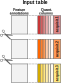
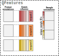

```{r theme, echo=FALSE}
xaringanthemer::style_mono_light(base_color = "#23395b")
```

```{r xaringanExtra, echo=FALSE}
xaringanExtra::use_webcam()     ## use w to turn on webcam
xaringanExtra::use_tile_view()  ## use o to get an overview
xaringanExtra::use_fit_screen() ## use Alt-F to fit to screen
xaringanExtra::use_extra_styles(
  hover_code_line = TRUE
  )
xaringanExtra::use_panelset()
```

```{r libraries, include = FALSE}
library(scp)
library(DT)
```

class: middle
name: cc-by

### Get the slides at [https://bit.ly/read_scp_data](https://bit.ly/read_scp_data)

These slides are available under a **creative common
[CC-BY license](http://creativecommons.org/licenses/by/4.0/)**. You are
free to share (copy and redistribute the material in any medium or
format) and adapt (remix, transform, and build upon the material) for
any purpose, even commercially
.

???
## Goals of the presentation

- Understand how `readSCP()` converts data tables into `QFeatures`
- Understand what the minimal requirements are for using `readSCP()`
- Understand the different pieces of information in a `QFeatures` object
- Understand what `readSCP()` does and how to use it 

---

class: middle, center, inverse

# How can I convert my single-cell proteomics data to a QFeatures object?

---

class: middle

## How can I convert my single-cell proteomics data to a QFeatures object?

The `readSCP()` function converts quantified MS data tables to
`QFeatures` objects. 

<br>
```{r echo=FALSE, out.width='90%', fig.align = 'center'}
knitr::include_graphics('./figs/read_scp_data_readSCP.svg')
```

---

class: 

## Feature data

.panelset[
.panel[.panel-name[Description]
.left-column[

```{r echo=FALSE, out.width='100%', fig.align = 'center'}
knitr::include_graphics('./figs/read_scp_data_inputTable.png')
```

]
.right-column[

Input table = output table from pre-processing software, such as 
MaxQuant (*e.g.* `evidence.txt`) or ProteomeDiscoverer (*e.g.* 
`PSMs.txt`). 

In general, 3 types of columns:

- feature annotations: *e.g.* peptide sequence, ion charge, protein name
- quantification columns: 1 to n (depending on technology)
- MS acquisition name: *e.g.* file name

]
]
.panel[.panel-name[Example]

```{r, echo = FALSE}
data("mqScpData")
selCols <- c("Sequence", "Length", "Charge", "Retention.time", "PEP",
             "Leading.razor.protein", 
             grep("intensity.\\d", colnames(mqScpData), value = TRUE),
             "Raw.file")
datatable(mqScpData[1:8, selCols], 
          options = list(scrollX = "200px",
                         paging = FALSE,
                         info = FALSE))
```

]
]

???

One column corresponds to several samples.

In label-free settings, there can be a single quantification column or
the quantification results for each MS acquistion can be stored in 
separated columns. When multiplexing, there are as many columns as 
there are labels. 


---

class: 

## Sample annotation

.panelset[
.panel[.panel-name[Description]
.left-column[

```{r echo=FALSE, out.width='90%', fig.align = 'center'}
knitr::include_graphics('./figs/read_scp_data_sampleTable.png')
```

]
.right-column[

Sample table = table generated by the researcher. 

Two columns are **required**:

- Names of the quantification columns from the input table
- MS acquisition name, same as in the input table

Other columns can contain additional sample annotations, such as: 

- Experiment metadata (date, researcher's name, instruments, ...)
- Sample preparation (cell culture batch, LC batch, TMT label, ...)
- Sample metadata (species, treatment, disease, sex, age, ...)
- Sample type (single-cells, carrier, blanks, ...)
- Other data (FACS data, microscopy data, phenotypic data, ...)
- ...

]
]
.panel[.panel-name[Example]

```{r, echo = FALSE}
data("sampleAnnotation")
datatable(sampleAnnotation[1:8, ], 
          options = list(scrollX = "200px",
                         paging = FALSE,
                         info = FALSE))
```

]
]

---

class: middle, center, inverse

# What's happening under the hood?

---

class:

## What's happening under the hood?

.panelset[
.panel[.panel-name[Step1]
.left-column[

```{r echo=FALSE, out.width='80%', fig.align = 'center'}
knitr::include_graphics('./figs/read_scp_data_step1.svg')
```

]
.right-column[

The feature annotations are separated from the quantitative data.

The two table pieces are converted to a **Bioconductor** 
[`SingleCellExperiment`](https://www.bioconductor.org/packages/release/bioc/vignettes/SingleCellExperiment/inst/doc/intro.html)
object [1], a specialized data container that creates an interface to 
existing functions to analyse single-cell data.

<br><br><br>
<p style="color:grey;font-size:0.75em;">
[1] Amezquita, Robert A., Aaron T. L. Lun, Etienne Becht, Vince J. Carey, Lindsay N. Carpp, Ludwig Geistlinger, Federico Martini, et al. 2019. “Orchestrating Single-Cell Analysis with Bioconductor.” Nature Methods, December, 1–9.
</p> 

]
]
.panel[.panel-name[Step2]

.left-column[

```{r echo=FALSE, out.width='100%', fig.align = 'center'}

```

]
.right-column[

The data is then split based on the MS acquisition. 

Each quantitative column now corresponds to a **single** and **unique**
sample.

]
]
.panel[.panel-name[Step3]
.pull-left[

```{r echo=FALSE, out.width='100%', fig.align = 'center'}
knitr::include_graphics('./figs/read_scp_data_step3.svg')
```

]
.pull-right[


The sample table is matched to the split feature data. This is 
performed based on the two **required** columns:

- MS acquisition name to match each data piece
- Quantification column names to match columns in each data piece

**Unique sample IDs** are created

]
]
.panel[.panel-name[Step4]
.pull-left[

```{r echo=FALSE, out.width='80%', fig.align = 'center'}

```

]
.pull-right[

All the data pieces are wrapped into a `QFeatures` object.

Overall, the `QFeatures` format enables seamless **data management and access**,
important for **downstream** data processing and visualisation.
]
]
]

---

class: middle, center, inverse

# readSCP() in practice

---

class:

## `readSCP()` in practice

.panelset[
.panel[.panel-name[Data]
.pull-left[

`sampleTable`

```{r echo=FALSE}
sampleTable <- sampleAnnotation
datatable(sampleTable[1:6, c("Raw.file", "Channel")], 
          options = list(scrollX = "200px",
                         paging = FALSE,
                         info = FALSE))
```

]
.pull-right[

`inputTable`

```{r echo=FALSE}
inputTable <- mqScpData
selCols <- c("Raw.file", grep("intensity.\\d", colnames(mqScpData), value = TRUE))
datatable(inputTable[1:6, selCols], 
          options = list(scrollX = "200px",
                         paging = FALSE,
                         info = FALSE))
```

]
]
.panel[.panel-name[Code]

```{r, eval = FALSE}
readSCP(inputTable,
        sampleTable, 
        batchCol = "Raw.file",
        channelCol = "Channel")
```

Overview of the resulting `QFeatures` object:

```{r, echo = FALSE, message = FALSE}
readSCP(inputTable,
        sampleTable, 
        batchCol = "Raw.file",
        channelCol = "Channel")
```

]
]

---

class: middle, inverse, center

# Quick survey

---

class: middle

## Fill the blanks

.pull-left[

`inputTable`

```{r, echo = FALSE}
coln <- paste0("lab", 1:2)
m <- matrix(round(runif(6) * 1E4),
            ncol = length(coln), 
            dimnames = list(NULL, coln))
df <- data.frame(MSrun = c("A", "A", "B"),
                 Peptide = c("AYGGEGP", "QSRTSGRG", "QSRTSGRG"),
                 m)
datatable(df,
          options = list(paging = FALSE,
                         searching = FALSE,
                         info = FALSE))
```


]
.pull-right[

`sampleTable`

```{r, echo = FALSE}
df <- data.frame(MSrun = c(rep("A", 4), rep("B", 2)),
                 Label = c(rep(coln, 3)),
                 CellType = rep(c("HeLa", "HEK293"), 3))
datatable(df,
          options = list(paging = FALSE,
                         searching = FALSE,
                         info = FALSE))
```

]

```{r, eval = FALSE}
readSCP(inputTable, sampleTable, 
        batchCol = ...(A)...,  channelCol = ...(B)...)
```


---

class: middle

### Further information

Learn more about loading single-cell proteomics data as a `QFeatures` 
object in our dedicated vignette at 
https://uclouvain-cbio.github.io/scp/articles/read_scp.html.

### Funding

Fonds de la Recherche Scientifique (FNRS), Belgium
