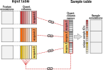

```{r theme, echo=FALSE}
xaringanthemer::style_mono_light(base_color = "#23395b")
```

```{r xaringanExtra, echo=FALSE}
xaringanExtra::use_webcam()     ## use w to turn on webcam
xaringanExtra::use_tile_view()  ## use o to get an overview
xaringanExtra::use_fit_screen() ## use Alt-F to fit to screen
xaringanExtra::use_extra_styles(
  hover_code_line = TRUE
  )
xaringanExtra::use_panelset()
```

```{r libraries, include = FALSE}
library(scp)
library(DT)
```

class: middle
name: cc-by

### Get the slides at [https://bit.ly/read_scp_data](https://bit.ly/read_scp_data)

These slides are available under a **creative common
[CC-BY license](http://creativecommons.org/licenses/by/4.0/)**. You are
free to share (copy and redistribute the material in any medium or
format) and adapt (remix, transform, and build upon the material) for
any purpose, even commercially
.

???

In this presentation, you will learn how to convert data tables into 
`QFeatures` objects that can be used for data processing. 

I highly recommend you to watch the previous video about handling
quantitative proteomics features if that's not already done.

The slides are available at the given link and are shared under CC-BY 
license. 

---

class: middle, center, inverse

# How can I convert my single-cell proteomics data to a QFeatures object?

??? So the focus point of this presentation is answering this question:
how can I convert my single-cell proteomics data to a QFeatures object?

---

class: middle

## How can I convert my single-cell proteomics data to a QFeatures object?

The `readSCP()` function converts quantified mass spectrometry data 
tables to `QFeatures` objects. 

<br>
```{r echo=FALSE, out.width='90%', fig.align = 'center'}

```

??? 
A quick answer: thanks to the `readSCP()` function that converts 
quantified MS data tables to `QFeatures` objects. 

`readSCP()` takes an input table and a sample table and combines them
into a ready-to-process `QFeatures` object. Let me explain what those
two tables correspond to. 

---

class: 

## Input table

.panelset[
.panel[.panel-name[Description]
.left-column[

```{r echo=FALSE, out.width='100%', fig.align = 'center'}

```

]
.right-column[

Input table = output table from pre-processing software, such as 
MaxQuant (*e.g.* `evidence.txt`) or ProteomeDiscoverer (*e.g.* 
`PSMs.txt`). 

In general, 3 types of columns:

- feature annotations: *e.g.* peptide sequence, ion charge, protein name
- quantification columns: 1 to n (depending on technology)
- acquisition data: *e.g.* file name

]
]
.panel[.panel-name[Example]

```{r, echo = FALSE}
data("mqScpData")
selCols <- c("Sequence", "Length", "Charge", "Retention.time", "PEP",
             "Leading.razor.protein", 
             grep("intensity.\\d", colnames(mqScpData), value = TRUE),
             "Raw.file")
datatable(mqScpData[1:8, selCols], 
          options = list(scrollX = "200px",
                         paging = FALSE,
                         info = FALSE))
```

]
]

???
### Description

The input table is typically a table that is generated by a 
pre-processing software, such as MaxQuant (you may already have 
encountered an `evidence.txt` file) or ProteomeDiscoverer (that creates
files ending with `PSMs.txt`). 

The input table usually contains 3 types of columns:

- Columns that hold the feature annotation, think about the peptide
  sequence, the charge of the ion analyzed by the mass spectrometer, the
  protein name
- You also have columns that hold the quantification data. The number
  of columns may vary depending on the technology. In label-free 
  settings, there can be a single quantification column or the 
  quantification results for each acquisition can be stored in a
  separated columns. When performing multiplexed experiments, there 
  are as many columns as there are labels. 
- The last type of columns are the data associated to the mass 
  spectrometry acquisition, like for instance the name of file where
  the instrument stored the data.

Let's have a look how this looks like for real data

### Example

The first columns here are annotations of the features, with the 
peptide sequence, its length, the ion charge, etc. Then, there is the 
quantitative data, since all elements are numbers corresponding to ion
intensities. You can identify the quantitative data in this specific
example because the column names start with `Reporter.intensity.` 
followed by a number. The last columns is the name of the acquisition
and relates to the mass spectrometry run.

---

class: 

## Sample annotation

.panelset[
.panel[.panel-name[Description]
.left-column[

```{r echo=FALSE, out.width='80%', fig.align = 'center'}
knitr::include_graphics('./figs/read_scp_data_sampleTable.png')
```

]
.right-column[

Sample table = table generated by the researcher. 

1 line = 1 sample

Two columns are **required**:

- Names of the quantification columns from the input table
- Acquisition name, same as in the input table

Other columns can contain additional sample annotations, such as: 

- Experiment metadata (date, researcher's name, instruments, ...)
- Sample preparation (cell culture batch, LC batch, TMT label, ...)
- Sample metadata (species, treatment, disease, sex, age, ...)
- Sample type (single-cells, carrier, blanks, ...)
- Other data (FACS data, microscopy data, phenotypic data, ...)
- ...

]
]
.panel[.panel-name[Example]

```{r, echo = FALSE}
data("sampleAnnotation")
datatable(sampleAnnotation[1:8, ], 
          options = list(scrollX = "200px",
                         paging = FALSE,
                         info = FALSE))
```

]
]

???
### Description

Next to the input table, the `readSCP` function requires a sample table.
This is generated by the researcher. Each line contains information 
about a single sample. 

2 columns are required to work with `readSCP`. The first column tells
the software what are the names of the columns containing the 
quantification data in the input table. The other column contains the
acquisition names, just like we saw for the input table. 

Beside those 2 required columns, you can include any sample data you
have, be it experimental metadata, sample preparation information, 
sample types or other data collected during sample preparation. These
data are valuable when it comes to data modelling!

### Example

In this example, the 2 first columns are the required columns. The 
first column is very similar to the column in the input data and may
notice that the second column holds the names that I pointed out as
quantitative columns in the input table. The remaining columns show you
an example of additional information that could be available. 

---

class: middle, center, inverse

# What happens under the hood?

???
You may ask yourself: what is `readSCP` exactly doing?  

---

class:

## What happens under the hood?

.panelset[
.panel[.panel-name[Step1]
.left-column[

```{r echo=FALSE, out.width='80%', fig.align = 'center'}

```

]
.right-column[

The feature annotations are separated from the quantitative data.

The two table pieces are converted to a
[`SingleCellExperiment`](https://www.bioconductor.org/packages/release/bioc/vignettes/SingleCellExperiment/inst/doc/intro.html)
object [1], a specialized **Bioconductor** data container that creates an interface to 
existing functions to analyse single-cell data.

<br><br><br>
<p style="color:grey;font-size:0.75em;">
[1] Amezquita, Robert A., Aaron T. L. Lun, Etienne Becht, Vince J. Carey, Lindsay N. Carpp, Ludwig Geistlinger, Federico Martini, et al. 2019. “Orchestrating Single-Cell Analysis with Bioconductor.” Nature Methods, December, 1–9.
</p> 

]
]
.panel[.panel-name[Step2]

.left-column[

```{r echo=FALSE, out.width='100%', fig.align = 'center'}
knitr::include_graphics('./figs/read_scp_data_step2.svg')
```

]
.right-column[

The data is then split based on the acquisition name. 

Each quantitative column now corresponds to a **single** and **unique**
sample.

]
]
.panel[.panel-name[Step3]
.pull-left[

```{r echo=FALSE, out.width='100%', fig.align = 'center'}

```

]
.pull-right[


The sample table is matched to the split feature data. This is 
performed based on the two **required** columns:

- Acquisition name to match each data piece
- Quantification column names to match columns in each data piece

**Unique sample IDs** are created

]
]
.panel[.panel-name[Step4]
.pull-left[

```{r echo=FALSE, out.width='80%', fig.align = 'center'}
knitr::include_graphics('./figs/read_scp_data_step4.svg')
```

]
.pull-right[

All the data pieces are wrapped into a `QFeatures` object.

Overall, the `QFeatures` format enables seamless **data management and access**,
important for **downstream** data processing and visualisation.
]
]
]

???
Well, `readSCP` prepares the data in 4 main steps. 

### Step1 

First, it take the input table and separates the feature annotation 
from the quantitative data. The two table can then be converted to a
SingleCellExperiment object that is a specialized Bioconductor data 
container that creates an interface to existing functions to analyse 
single-cell data. 

### Step2

Next, the data is further split, but this time, the split is along the
rows based on the mass spectrometry acquisition run. Because the 
acquisitions are now separated, each quantitative column now corresponds
to a single and unique sample. 

### Step3

In step3, the sample annotations are linked to the quantification data.
this is performed based on the two required columns I just described. 
First, the acquisition names are matched between the input table and 
the sample table. Next, the quantitative columns names from the sample
tables are used to link each sample to its corresponding quantification
column. The combination of quantification column name and acquisition 
name creates unique sample identifiers that are stored in the sample
table. 

### Step4

The final step is to wrap all those data pieces into a `QFeatures`
object. Overall, the QFeatures format enables seamless data management
and access that are important for downstream data processing and 
visualisation.

---

class: middle, center, inverse

# readSCP() in practice

???
Let me now show you how to use `readSCP` in practice

---

class:

## `readSCP()` in practice

.panelset[
.panel[.panel-name[Data]
.pull-left[

`sampleTable`

```{r echo=FALSE}
sampleTable <- sampleAnnotation
datatable(sampleTable[1:6, c("Raw.file", "Channel")], 
          options = list(scrollX = "200px",
                         paging = FALSE,
                         info = FALSE))
```

]
.pull-right[

`inputTable`

```{r echo=FALSE}
inputTable <- mqScpData
selCols <- c("Raw.file", grep("intensity.\\d", colnames(mqScpData), value = TRUE))
datatable(inputTable[1:6, selCols], 
          options = list(scrollX = "200px",
                         paging = FALSE,
                         info = FALSE))
```

]
]
.panel[.panel-name[Code]

```{r, eval = FALSE}
readSCP(inputTable,
        sampleTable, 
        batchCol = "Raw.file",
        channelCol = "Channel")
```

Overview of the resulting `QFeatures` object:

```{r, echo = FALSE, message = FALSE}
readSCP(inputTable,
        sampleTable, 
        batchCol = "Raw.file",
        channelCol = "Channel")
```

]
]

???
### Data

Consider the two example tables here that are very similar to the ones I 
showed previously. Note that both table contain the `Raw.file` column
necessary for mathcing the acquisition runs. See also that the `Channel`
column in the `sampleTable` contains the names of the quantification 
column in the `inputTable`.

### Code

Well, you can convert those two tables to a `QFeatures` object using
`readSCP()` by running the command shown here. We call `readSCP()`, we
provide the 2 tables, but we also need to tell how the matching is 
performed. We here tell the function which column in both tables 
should be used to match the acquisition batch, in this case remember 
it was `Raw.file`. Then, we need to tell the function which column in
the sample table contains the quantification columns, it's the column
called `Channel` in this example. 

When running the command, we create a new object and I show the output
here. You can see that we indeed have a `QFeatures` object with 4 assays
because there are 4 acquisitions. Each assay is a SingleCellExperiment
object with variable number of rows, here corresponding to PSMs and 16
columns because a 16 label multiplexing was used to acquire the data. 

I hope that you can now understand how to convert your single-cell 
proteomics data into a `QFeatures` object. 

---

class: middle, inverse, center

# Exercise

???
I suggest to test your understanding with a small exercise. 

---

class: middle

#### Given the input and sample tables, What command creates a single-cell proteomics QFeatures object?

.pull-left[

`inputTable`

```{r, echo = FALSE}
coln <- paste0("lab", 1:2)
m <- matrix(round(runif(6) * 1E4),
            ncol = length(coln), 
            dimnames = list(NULL, coln))
df <- data.frame(MSrun = c("A", "A", "B"),
                 Peptide = c("AYGGEGP", "QSRTSGRG", "QSRTSGRG"),
                 m)
datatable(df,
          options = list(paging = FALSE,
                         searching = FALSE,
                         info = FALSE))
```


]
.pull-right[

`sampleTable`

```{r, echo = FALSE}
df <- data.frame(MSrun = c(rep("A", 4), rep("B", 2)),
                 Label = c(rep(coln, 3)),
                 CellType = rep(c("HeLa", "HEK293"), 3))
datatable(df,
          options = list(paging = FALSE,
                         searching = FALSE,
                         info = FALSE))
```

]

```{r, eval = FALSE}
1. readSCP(inputTable, sampleTable, batchCol = "Label",  channelCol = c("lab1", "lab2"))
2. readSCP(inputTable, sampleTable, batchCol = "MSrun",  channelCol = c("lab1", "lab2"))
3. readSCP(inputTable, sampleTable, batchCol = "MSrun",  channelCol = "Label")
4. readSCP(inputTable, sampleTable, batchCol = "CellType",  channelCol = "Label")
```


---

class: middle

### Further information

Learn more about loading single-cell proteomics data as a `QFeatures` 
object in our dedicated vignette at 
https://uclouvain-cbio.github.io/scp/articles/read_scp.html.

### Funding

Fonds de la Recherche Scientifique (FNRS), Belgium
