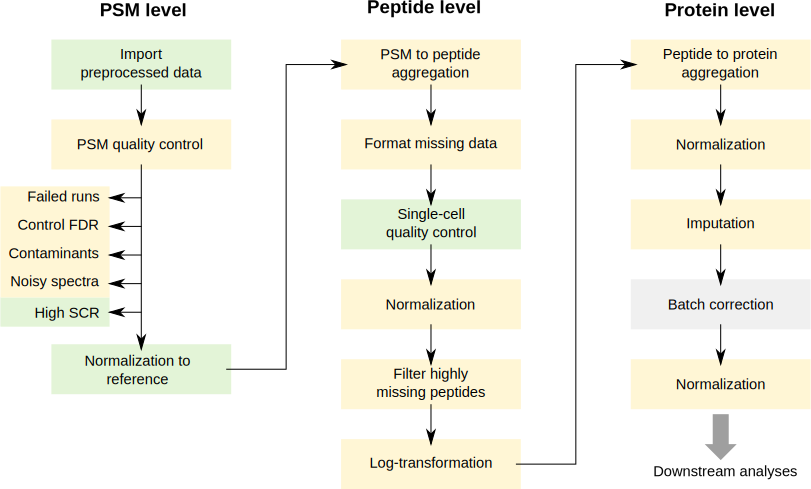
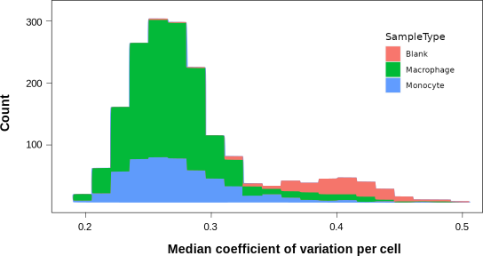

```{r theme, echo=FALSE}
xaringanthemer::style_mono_light(base_color = "#23395b")
```

```{r xaringanExtra, echo=FALSE}
xaringanExtra::use_webcam()     ## use w to turn on webcam
xaringanExtra::use_tile_view()  ## use o to get an overview
xaringanExtra::use_fit_screen() ## use Alt-F to fit to screen
xaringanExtra::use_extra_styles(
    hover_code_line = TRUE
)
xaringanExtra::use_panelset()
```

```{r libraries, include = FALSE}
library(scp)
library(tidyverse)
```

```{r knitr_opts, include = FALSE}
knitr::opts_chunk$set(dpi = 300, 
                      fig.width = 7,
                      message = FALSE, 
                      warning = FALSE)
```

class: middle
name: cc-by

### Get the slides at [https://bit.ly/scp_processing](https://bit.ly/scp_processing)

These slides are available under a **creative common
[CC-BY license](http://creativecommons.org/licenses/by/4.0/)**. You are
free to share (copy and redistribute the material in any medium or
format) and adapt (remix, transform, and build upon the material) for
any purpose, even commercially
.

???
## Goals of the presentation

- Get an overview of the SCoPE2 workflow and identify which steps are
implemented in `QFeatures` and which steps are specific to `scp`
- Understand PSM quality control and have a first look at how you can
perform this with our software
- Understand single-cell quality control and have a first look at how 
you can perform this with our software
- Get an example of downstream visualization

---

class: middle, inverse, center

# How to process single-cell proteomics data? 

---

class: middle

## How to process single-cell proteomics data? 

Overview of the workflow suggested in the SCoPE2 seminal paper [1].

```{r echo=FALSE, out.width='50%', fig.align = 'center'}

```

A full reproduction of the workflow using `scp` and `QFeatures` is 
available from our 
[preprint](http://dx.doi.org/10.1101/2021.04.12.439408) [2] and 
[replication vignette](https://uclouvain-cbio.github.io/SCP.replication/articles/SCoPE2.html).

<p style="color:grey;font-size:0.75em;">
[1] Specht, Harrison, Edward Emmott, Aleksandra A. Petelski, R. Gray 
Huffman, David H. Perlman, Marco Serra, Peter Kharchenko, Antonius 
Koller, and Nikolai Slavov. 2021. “Single-Cell Proteomic and 
Transcriptomic Analysis of Macrophage Heterogeneity Using SCoPE2.” 
Genome Biology 22 (1): 50.
<br>
[2] Vanderaa, Christophe, and Laurent Gatto. 2021. “Utilizing Scp for
the Analysis and Replication of Single-Cell Proteomics Data.” bioRxiv.
</p> 

???
Blue boxes are implemented in `QFeatures` (common to bulk proteomics),
the red boxes are implemented in `scp` because single-cell specific. 

We will not be able to cover all steps due to time constraints

We do not claim that the SCoPE2 workflow is the best possible workflow

---

class: middle, center, inverse

# How to perform PSM quality control?

---

class:

## PSM quality control

.panelset[
.panel[.panel-name[Description]

<br> PSM quality control removes low-quality PSMs to **improve the
reliability** of downstream analysis results.

<br> 
**Example**: sample to carrier ratio

The sample to carrier ratio is the signal from samples divided by the
signal of the carrier (tens to hundreds of cell equivalent).

PSMs with high ratios indicate issues during acquisition and/or 
quantification and need to be removed. 

]
.panel[.panel-name[Plot]

Distribution of the sample to carrier ratio computed for all PSMs.        

```{r, out.width = "80%", fig.asp = 0.4, echo = FALSE, fig.align = 'center'}
data("scp1")
scope2Data <- scp1[, , 1:3]
scope2Data <- computeSCR(scope2Data, i = 1:3, colvar = "SampleType",
                         samplePattern = "Macrophage|Monocyte|Blank",
                         carrierPattern = "Carrier", rowDataName = "SCR")
data.frame(rbindRowData(scope2Data, i = 1:3)) %>% 
    ggplot() +
    aes(x = SCR) +
    geom_histogram() +
    geom_vline(xintercept = 0.1, lty = "dashed") +
    scale_x_log10() +
    xlab("Signal to carrier ratio")
```


]
.panel[.panel-name[Code]

Code for computing signal to carrier ratio for each PSM:

```{r, eval = FALSE}
scope2Data <- computeSCR(scope2Data, i = 1:3, colvar = "SampleType",
                         samplePattern = "Macrophage|Monocyte|Blank",
                         carrierPattern = "Carrier", rowDataName = "SCR")
```

Minimal code for plotting:

```{r, eval = FALSE}
rd <- rbindRowData(scope2Data, i = 1:3)
ggplot(data.frame(rd)) +
    aes(x = SCR) +
    geom_histogram() +
    scale_x_log10()
```

Code for filtering:

```{r, eval = FALSE}
scope2Data <- filterFeatures(scope2Data, ~ PIF > 0.8)
```

]
]

---

class: middle, center, inverse

# How to perform single-cell quality control?

---

class:

## Single-cell quality control

.panelset[
.panel[.panel-name[Description]

<br> Single-cell quality control removes failed cell to **improve the
reliability** of downstream analysis results.

<br> 
**Example**: median coefficient of variation

The coefficient of variation measures the robustness of quantification
for a protein in a sample. Taking the median across a single cell 
provides an estimate of the robustness of quantification within that
single cell.

Single cells with a high median coefficient of variation indicate 
issues during acquisition and need to be removed. 

]
.panel[.panel-name[Plot]

Distribution of the median coefficient of variation computed for all 
single-cell and blank samples. 

```{r, out.width = "70%", fig.asp = 0.5, echo = FALSE, fig.align = 'center'}
data("scp1")
scope2Data <- scp1
scope2Data <- subsetByColData(scope2Data, scope2Data$SampleType %in% c("Macrophage", "Monocyte", "Blank"))
scope2Data <- medianCVperCell(scope2Data, i = 1:3, 
                              groupBy = "Leading.razor.protein", 
                              colDataName = "medianCV",
                              nobs = 6, 
                              norm = "SCoPE2")
data.frame(colData(scope2Data)) %>% 
    ggplot() +
    aes(x = medianCV,
        fill = SampleType) +
    geom_histogram() +
    scale_x_log10() +
    geom_vline(xintercept = 0.5, lty = "dashed")
```

]
.panel[.panel-name[Code]

Code for computing the median coefficient of variation:

```{r, eval = FALSE}
scope2Data <- medianCVperCell(scope2Data, i = 1:3, groupBy = "Leading.razor.protein", 
                              colDataName = "medianCV", nobs = 6,  norm = "SCoPE2")
```

Minimal code for plotting:

```{r, eval = FALSE}
cd <- colData(scope2Data)
ggplot(data.frame(cd)) +
    aes(x = medianCV, fill = SampleType) +
    geom_histogram() +
    scale_x_log10() +
    geom_vline(xintercept = 0.5, lty = "dashed")
```

Code for filtering:

```{r, eval = FALSE}
scope2Data <- subsetByColData(scope2Data, scope2Data$medianCV < 0.5)
```

]
]

---

class: middle, inverse, center

# What's next after data processing?

---

class: 

## What's next after data processing?

.panelset[
.panel[.panel-name[Description]

Downstream analysis is were the fun begins!

Common analyses: dimension reduction, cluster analysis, cluster 
annotation, differential protein abundance analysis, ...

Many methods are readily applicable to the data thanks to the 
**Bioconductor** 
[`SingleCellExperiment`](https://www.bioconductor.org/packages/release/bioc/vignettes/SingleCellExperiment/inst/doc/intro.html)
container [1]

**Example**: dimension reduction using the `scater` R package. 

<br>
<p style="color:grey;font-size:0.75em;">
[1] Amezquita, Robert A., Aaron T. L. Lun, Etienne Becht, Vince J. Carey, Lindsay N. Carpp, Ludwig Geistlinger, Federico Martini, et al. 2019. “Orchestrating Single-Cell Analysis with Bioconductor.” Nature Methods, December, 1–9.
</p> 

]
.panel[.panel-name[Plot]

t-SNE plot of the protein data. 

```{r, out.width = "80%", fig.asp = 0.4, echo = FALSE, fig.align = 'center'}
data("scp1")
scope2Data <- scp1
library(scater)
prots <- getWithColData(scope2Data, "proteins")
prots <- runTSNE(impute(prots, method = "zero"), 
                 exprs_values = 1,
                 perplexity = 5, 
                 name = "TSNE")
plotTSNE(prots, colour_by = "Set")
```

]
.panel[.panel-name[Code]

Code for getting the protein data with sample annotations:

```{r, eval = FALSE}
prots <- getWithColData(scope2Data, "proteins")
```

Code for computing the tSNE (after imputation by zero):

```{r, eval = FALSE}
prots <- impute(prots, method = "zero")
prots <- runTSNE(prots, exprs_values = 1, perplexity = 5,  name = "TSNE")
```

Code for plotting:

```{r, eval = FALSE}
plotTSNE(prots, colour_by = "Set")
```

]
]

---

class: middle, inverse, center

# Exercise

---

class: middle

## Set the correct filtering threshold

Given the distribution of the median coefficient of variation per cell,
which command would you used to remove low-quality cells?

```{r echo=FALSE, out.width='50%', fig.align = 'center'}

```

```{r, eval = FALSE}
subsetByColData(scope2Data, scope2Data$medianCV < 0.25)
subsetByColData(scope2Data, scope2Data$medianCV > 0.25)
subsetByColData(scope2Data, scope2Data$medianCV < 0.32)
subsetByColData(scope2Data, scope2Data$medianCV > 0.32)
subsetByColData(scope2Data, scope2Data$medianCV < 0.45)
subsetByColData(scope2Data, scope2Data$medianCV > 0.45)
```


---

class: middle

### Further information

* Check out our vignette where we fully replicated the SCoPE2 workflow:
  https://uclouvain-cbio.github.io/SCP.replication/articles/SCoPE2.html
* Check out our prepint where we discuss the current challenges in 
  single-cell proteomics data anylysis: 
  http://dx.doi.org/10.1101/2021.04.12.439408)
* Try it yourself in this online workshop: 
  https://lgatto.github.io/QFeaturesScpWorkshop2021/

### Funding

Fonds de la Recherche Scientifique (FNRS), Belgium
